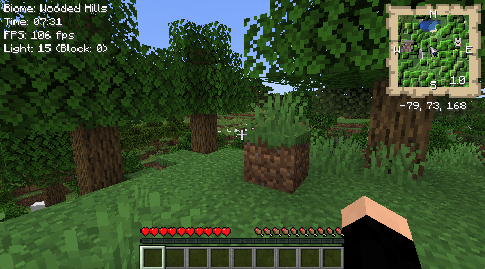
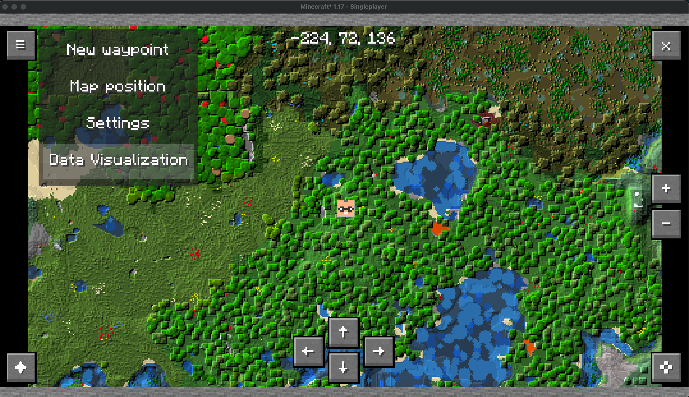
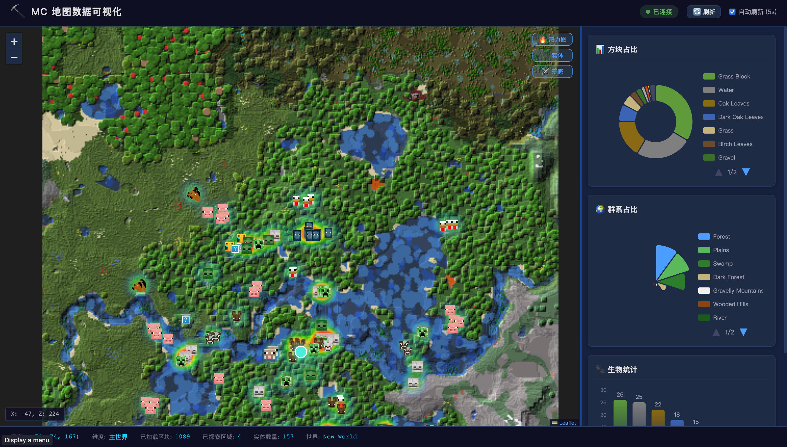

# MC 地图数据可视化

> 基于 JustMap 模组的 Minecraft 地图数据可视化系统
> 使用 **Leaflet + ECharts + 热力图** 实时展示游戏世界的方块、群系、生物分布


---

## 📖 项目简介

本项目为 Minecraft Fabric 模组 **JustMap** 增加了**数据可视化功能**。玩家在游戏中按一个快捷键或点击菜单按钮，模组会自动启动内嵌 HTTP 服务器并在浏览器中打开一个交互式可视化页面，实时展示：

- 🗺️ **地图瓦片** — 复用 JustMap 已探索的 PNG 地图缓存
- 📊 **方块占比** — 环形图展示地表方块类型分布（Top 10 + 其他）
- 🌍 **群系占比** — 南丁格尔玫瑰图展示生物群系分布
- 🐾 **生物统计** — 柱状图展示各类生物数量
- 🔥 **生物热力图** — 基于 Leaflet.heat 展示生物密度分布
- ️ **玩家位置** — 实时追踪玩家坐标

<table>
  <tr>
    <td align="center"></td>
    <td align="center"></td>
    <td align="center"></td>
  </tr>
  <tr>
    <td align="center"><b>游戏内截图</b></td>
    <td align="center"><b>Web 可视化界面</b></td>
    <td align="center"><b>完整界面展开图</b></td>
  </tr>
</table>

## 🏗️ 架构设计

```
┌─────────────────────────────────────────────────┐
│               Minecraft 客户端                    │
│  ┌────────────────────────────────────────────┐  │
│  │  JustMap Mod + 可视化模块 (Java)            │  │
│  │  ┌──────────────┐  ┌───────────────────┐  │  │
│  │  │WorldmapScreen│  │ DataCollector     │  │  │
│  │  │ +菜单项/按钮  │→│ - 方块统计        │  │  │
│  │  └──────────────┘  │ - 群系统计        │  │  │
│  │                     │ - 实体位置        │  │  │
│  │  ┌──────────────┐  └───────────────────┘  │  │
│  │  │ VisHttpServer│  ← JDK内置HttpServer    │  │
│  │  │ :27681       │     零外部依赖          │  │
│  │  └──────┬───────┘                         │  │
│  └─────────┼─────────────────────────────────┘  │
└────────────┼────────────────────────────────────┘
             │ HTTP (localhost)
             ▼
┌─────────────────────────────────────────────────┐
│              浏览器 (Web Frontend)               │
│  ┌────────────────────────────────────────────┐  │
│  │  Leaflet (CRS.Simple)                      │  │
│  │  ├─ 底图: JustMap PNG 瓦片                 │  │
│  │  ├─ 热力图: 生物密度 (leaflet-heat)        │  │
│  │  └─ 标记: 玩家/实体位置                    │  │
│  │                                            │  │
│  │  ECharts 5.x                               │  │
│  │  ├─ 环形图: 方块占比                       │  │
│  │  ├─ 玫瑰图: 群系占比                       │  │
│  │  └─ 柱状图: 各类生物数量                   │  │
│  │                                            │  │
│  │  ⏱ 每 5 秒轮询 /api/data 实时刷新          │  │
│  └────────────────────────────────────────────┘  │
└─────────────────────────────────────────────────┘
```

## 📁 项目结构

```
JustMap_DataVisualization/
├── src/main/java/ru/bulldog/justmap/
│   ├── visualization/                    ← 新增可视化模块
│   │   ├── DataCollector.java            ← 数据采集（方块/群系/实体）
│   │   ├── VisHttpServer.java            ← 内嵌 HTTP 服务器
│   │   └── VisDataModels.java            ← 数据模型（JSON序列化）
│   └── client/
│       ├── control/KeyHandler.java       ← [修改] 添加 V 键快捷键
│       └── screen/WorldmapScreen.java    ← [修改] 添加可视化菜单项
├── src/main/resources/
│   └── assets/justmap/
│       ├── web/                          ← Web 前端资源
│       │   ├── index.html                ← 主页面
│       │   ├── css/style.css             ← MC风格深色主题
│       │   └── js/
│       │       ├── app.js                ← 主逻辑 + API轮询
│       │       ├── map.js                ← Leaflet地图模块
│       │       └── charts.js             ← ECharts图表模块
│       └── lang/
│           ├── en_us.json                ← [修改] 英文翻译
│           └── zh_cn.json                ← [修改] 中文翻译
├── demo-data/                            ← 演示数据（独立展示用）
│   ├── demo.html                         ← 独立演示页面
│   ├── tiles/                            ← 生成的MC风格地图瓦片
│   └── generate_demo_tile.py             ← 瓦片生成脚本
└── build/libs/
    └── justmap-1.2.24-1.17.1-release.jar ← 编译好的模组JAR
```

## 🚀 快速开始

### 方式一：安装模组（需要 Minecraft）

1. 安装 [Fabric Loader](https://fabricmc.net/use/) for MC 1.17.1
2. 将以下 JAR 放入 `.minecraft/mods/` 目录：
   - `justmap-1.2.24-1.17.1-release.jar`（本项目编译产物）
   - Fabric API
   - ModMenu（可选）
   - Cloth Config（可选）
3. 启动 Minecraft，进入世界
4. 按 **V** 键 或 按 **M** 打开大地图 → 菜单 → **数据可视化**
5. 浏览器自动打开 `http://localhost:27681`

### 方式二：纯演示（不需要 Minecraft）

```bash
# 进入演示数据目录
cd demo-data

# 启动本地服务器
python3 -m http.server 8080

# 浏览器访问
open http://localhost:8080/demo.html
```

或直接双击 `demo-data/demo.html` 打开（部分浏览器可能限制本地文件加载）。

## ⌨️ 操作说明

### 游戏内

| 按键 | 功能 |
|------|------|
| **V** | 切换数据可视化（启动/停止服务器） |
| **M** | 打开大地图（可在菜单中选择"数据可视化"） |

### 浏览器中

| 操作 | 功能 |
|------|------|
| 鼠标滚轮 | 缩放地图 |
| 拖拽 | 平移地图 |
| 🔥 热力图按钮 | 切换生物密度热力图显示 |
| 🐾 实体按钮 | 切换实体标记显示 |
| ⚔️ 玩家按钮 | 切换玩家位置标记 |
| 🔄 刷新按钮 | 手动刷新数据 |
| Ctrl+R | 快捷键刷新 |
| P | 居中到玩家位置 |

## 🔌 API 接口

模组启动后，以下 API 可在 `http://localhost:27681` 访问：

| 端点 | 说明 | 返回格式 |
|------|------|---------|
| `GET /api/data` | 综合数据（方块/群系/实体/玩家） | JSON |
| `GET /api/regions` | 已探索区域列表 | JSON Array |
| `GET /api/tiles/{x}/{z}.png` | 地图瓦片图片 | PNG |
| `GET /api/status` | 服务器状态 | JSON |

### /api/data 响应示例

```json
{
  "blocks": { "草方块": 28450, "石头": 18200, "水": 5600, ... },
  "biomes": { "平原": 35200, "森林": 22400, ... },
  "entities": [
    { "type": "猪", "x": 120.5, "y": 65, "z": -80.2, "category": "passive" },
    ...
  ],
  "entityCounts": { "猪": 3, "牛": 4, ... },
  "player": { "x": 0.0, "y": 64, "z": 0.0, "dimension": "overworld", "health": 20 },
  "stats": { "loadedChunks": 49, "exploredRegions": 4, ... },
  "regions": [ { "regionX": 0, "regionZ": 0, "layer": "surface" }, ... ]
}
```

## 🛠️ 技术栈

| 组件 | 技术 | 说明 |
|------|------|------|
| 模组框架 | Fabric (MC 1.17.1) | 轻量级模组加载器 |
| HTTP 服务器 | JDK `com.sun.net.httpserver` | 零外部依赖 |
| 前端地图 | Leaflet 1.9.4 + CRS.Simple | MC坐标直接映射 |
| 图表 | ECharts 5.4.3 | 饼图/玫瑰图/柱状图 |
| 热力图 | leaflet-heat 0.2.0 | 生物密度可视化 |
| 数据格式 | JSON (Gson) | 前后端通用 |
| 演示瓦片 | Python 3 (纯标准库) | 无依赖生成MC风格地形 |

## 📝 开发

### 编译

```bash
# 需要 Java 16+ 和 Git
./gradlew build

# 输出 JAR 位于 build/libs/
```

### 调试 Web 前端

无需启动 Minecraft，可以单独调试前端：

```bash
cd src/main/resources/assets/justmap/web
python3 -m http.server 8080
# 访问 http://localhost:8080 （将自动进入演示模式）
```

## 📋 验收标准

- [x] 按 V 键或点击菜单启动可视化服务器
- [x] Leaflet 正确展示 JustMap 缓存的地图瓦片
- [x] ECharts 环形图展示方块占比（Top 10 + 其他）
- [x] ECharts 玫瑰图展示群系占比
- [x] ECharts 柱状图展示生物统计
- [x] 热力图展示生物密度分布
- [x] 数据每 5 秒自动刷新（实时性）
- [x] 无 MC 运行时可加载演示数据独立展示
- [x] MC 风格深色主题，界面美观

## 📄 License

本项目基于 JustMap 模组（MIT License）修改。
